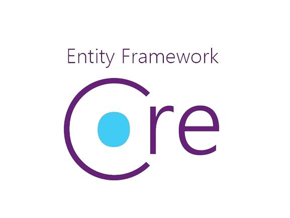
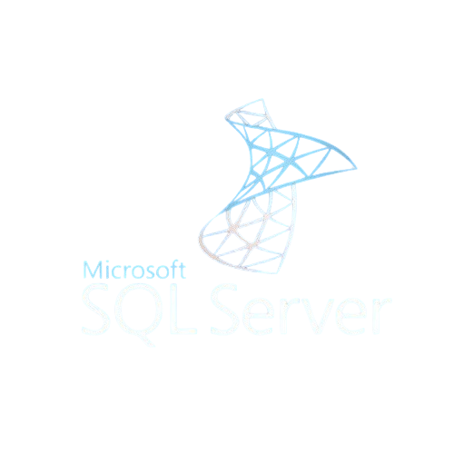
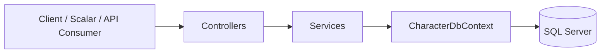

<p align="center">
  
  
  
</p>

<h1 align="center">VideoGameCharacterApi</h1>

<p align="center"><em>Focused backend learning project built to strengthen practical knowledge in ASP.NET Core Web API, Entity Framework Core, SQL Server, JWT authentication, testing, and Dockerized local setup.</em></p>

<p align="center">
  
  
  
  
  
  
</p>

---

## Project Overview

`VideoGameCharacterApi` is a backend-focused ASP.NET Core Web API project created to strengthen practical knowledge in modern server-side development through a structured, implementation-driven approach.

Rather than stopping at basic CRUD, the project is designed to consolidate core backend concepts in a more complete application setting: layered architecture, DTO-based API contracts, Entity Framework Core persistence, SQL Server integration, JWT authentication, role-based authorization, validation, automated testing, and Docker-based local delivery. The goal is to develop a project that is technically coherent, readable, and closer to a realistic engineering workflow than to an isolated tutorial exercise.

### Project Intent

| Goal                       | Description                                                                        |
| -------------------------- | ---------------------------------------------------------------------------------- |
| **Backend Practice**       | Apply practical ASP.NET Core Web API design in a project with realistic structure. |
| **Engineering Discipline** | Use separation of concerns, explicit DTOs, structured errors, and automated tests. |
| **Database Integration**   | Model persistence through Entity Framework Core and SQL Server.                    |
| **Security Fundamentals**  | Introduce JWT authentication and role-based authorization.                         |
| **Delivery Awareness**     | Run the application in a reproducible local environment through Docker.            |

## Core Capabilities

The project supports full character management operations and intentionally extends beyond record creation and retrieval. It uses explicit request and response DTOs, query shaping through filtering, sorting, and pagination, JWT-based authentication, role-based authorization, validation, centralized exception handling, automated tests, and Docker-based local delivery.

## Technology Stack

| Area                     | Technology                   |
| ------------------------ | ---------------------------- |
| **Language**             | C#                           |
| **Runtime**              | .NET 10                      |
| **Framework**            | ASP.NET Core Web API         |
| **ORM**                  | Entity Framework Core        |
| **Database**             | SQL Server                   |
| **Authentication**       | JWT Bearer                   |
| **API Documentation UI** | Scalar                       |
| **OpenAPI**              | ASP.NET Core OpenAPI support |
| **Testing**              | xUnit                        |
| **Containerization**     | Docker / Docker Compose      |

## Architecture Overview



The application follows a layered structure. Controllers remain thin and focus on HTTP concerns, while services hold application logic and query shaping. Entities are not exposed directly to API consumers; instead, DTOs define the request and response contract. Exception handling is centralized so that failures are returned in a more coherent form instead of being handled ad hoc inside multiple endpoints.

## Repository Structure

```text
VideoGameCharacterApi/
├── Controllers/
├── Data/
├── Dtos/
├── Infrastructure/
├── Migrations/
├── Models/
├── Services/
├── Properties/
├── appsettings.json
├── Dockerfile
├── Program.cs
├── VideoGameCharacterApi.csproj
├── VideoGameCharacterApi.http
└── README.md

VideoGameCharacterApi.Tests/
├── ...
```

### Folder Guide

| Folder                         | Purpose                                               |
| ------------------------------ | ----------------------------------------------------- |
| `Controllers/`                 | API endpoints and HTTP-facing logic.                  |
| `Data/`                        | Database context and database-related helpers.        |
| `Dtos/`                        | Request and response contracts.                       |
| `Infrastructure/`              | Global exception handler and infrastructure concerns. |
| `Migrations/`                  | EF Core migration history.                            |
| `Models/`                      | Domain and persistence entities.                      |
| `Services/`                    | Core application logic.                               |
| `VideoGameCharacterApi.Tests/` | Unit and integration test suite.                      |

## Getting Started

### Prerequisites

Before running the project locally, make sure the following are available:

* **.NET 10 SDK**
* **SQL Server** for non-Docker runs
* **Visual Studio** or **Visual Studio Code**
* Optional supporting tools such as **SSMS**, **Scalar**, or **Postman**

### Local Run

1. Clone the repository.
2. Open the solution in Visual Studio.
3. Confirm the local connection string in `appsettings.json` matches your SQL Server instance.
4. Apply migrations if necessary.
5. Start the API.

### Local Development Notes

This project is an API application, not a traditional website. Because of that, the base host may run without exposing a homepage at the root URL. In practice, a `404 Not Found` at `/` does not automatically indicate a failure.

For interactive browser-based inspection, the recommended entry point is the Scalar route rather than the bare host address. Also note that protected endpoints cannot be meaningfully tested from a plain browser address bar because bearer tokens are not conveniently attached there. For authenticated requests, Scalar or another API client should be used.

## Running with Docker

Docker is included to reduce environment setup friction and make the local delivery story more reproducible. Without Docker, another developer can still run the project manually, but they must reproduce the runtime, database, configuration, and startup sequencing on their own machine.

### Start Command

```bash
docker compose up --build
```

### Docker Routes

| Purpose          | URL                                     |
| ---------------- | --------------------------------------- |
| **API Base URL** | `http://localhost:8080`                 |
| **Scalar UI**    | `http://localhost:8080/scalar`          |
| **OpenAPI JSON** | `http://localhost:8080/openapi/v1.json` |

### Route Clarification

The most useful browser entry point is the Scalar route. The base host, `http://localhost:8080/`, may return `404` if no root endpoint is mapped, and that is normal for an API-only project. The OpenAPI JSON route exposes the raw OpenAPI document, while `/api/...` routes are the actual application endpoints.

## Authentication and Authorization

The API uses JWT Bearer authentication.

### Demo Accounts

| Username | Password   | Role    | Intended Use                                 |
| -------- | ---------- | ------- | -------------------------------------------- |
| `user`   | `user123`  | `User`  | Basic authenticated access.                  |
| `admin`  | `admin123` | `Admin` | Access to protected administrative behavior. |

### Authentication Flow

1. Send credentials to `POST /api/Auth/login`.
2. Receive a JWT token.
3. Attach the token as `Authorization: Bearer <token>`.
4. Access protected endpoints according to role requirements.

## API Summary

| Method   | Route                           | Description                                         |
| -------- | ------------------------------- | --------------------------------------------------- |
| `POST`   | `/api/Auth/login`               | Authenticates a user and returns a JWT.             |
| `GET`    | `/api/VideoGameCharacters`      | Returns paginated and filterable character results. |
| `GET`    | `/api/VideoGameCharacters/{id}` | Returns a single character by identifier.           |
| `POST`   | `/api/VideoGameCharacters`      | Creates a new character.                            |
| `PUT`    | `/api/VideoGameCharacters/{id}` | Updates an existing character.                      |
| `DELETE` | `/api/VideoGameCharacters/{id}` | Deletes a character.                                |

### Query Surface

The list endpoint supports more than a flat record dump. It allows the client to shape retrieval through pagination, filtering, sorting, and query validation.

### Protected Endpoint Access

Authentication in this API is JWT bearer-based. After a successful login through `POST /api/Auth/login`, the returned token must be attached to protected requests in the `Authorization` header using the following format:

```http
Authorization: Bearer <token>
```

### Example Request

```http
GET /api/VideoGameCharacters?page=1&pageSize=10&game=Tekken&sortBy=Name&sortDirection=asc
```

## Validation and Error Handling

Validation is applied in multiple layers so that invalid input is rejected as early and as consistently as possible.

### Validation Strategy

| Area                     | Approach                                               |
| ------------------------ | ------------------------------------------------------ |
| **Request DTOs**         | Data annotation-based validation.                      |
| **Query Input**          | Explicit query rules for pagination and list behavior. |
| **Model Binding**        | ASP.NET Core request binding and validation pipeline.  |
| **Unhandled Exceptions** | Global exception handler.                              |

### Character Role Rules

Character requests validate the `Role` field against a limited set of supported categories. The currently intended role categories are:

- `Protagonist`
- `Hero`
- `Antagonist`
- `Villain`

This field is validation-constrained, so values outside the supported set are rejected with a client error response.

### Error Response Strategy

* Client-side validation issues produce structured client-error responses.
* Unhandled exceptions are centralized instead of being scattered across controllers.
* ProblemDetails support improves consistency and readability.

The project uses a standardized ProblemDetails-oriented error strategy so that consumers receive more coherent error payloads instead of ad hoc strings.

## Database and Migrations

The application uses Entity Framework Core with SQL Server. The main database entry point is `CharacterDbContext`, which connects the application model to the database schema.

Schema evolution is managed through EF Core migrations stored in the `Migrations/` folder. This keeps database structure traceable alongside the codebase and allows the application to recreate or update the schema in a more controlled way.

## Testing

The current test suite focuses on practical application behavior rather than sheer volume.

It covers query-rule verification, authentication and authorization boundaries, success-path endpoint behavior, and integration test bootstrapping through `CustomWebApplicationFactory`. It provides a shared host bootstrapper for integration tests and avoids duplicated setup logic across test classes. In its current form it is intentionally minimal, which is appropriate for the current scope.

### Run Tests

```bash
dotnet test
```

### Continuous Integration

The repository includes a GitHub Actions workflow that automatically restores dependencies, builds the solution, and runs the test suite on push and pull request activity. This provides a basic CI check for repository health and helps catch build or test regressions early.

### Delivery Components

| Component               | Purpose                                              |
| ----------------------- | ---------------------------------------------------- |
| `Dockerfile`            | Packages the API for containerized execution.        |
| `docker-compose.yml`    | Starts the API and SQL Server together.              |
| GitHub Actions Pipeline | Intended to automate restore, build, and test steps. |

## Documentation Roadmap

Planned documentation includes:

* `docs/01-project-overview.md` for scope, goals, and project rationale
* `docs/02-architecture.md` for application structure and request flow
* `docs/03-api-reference.md` for endpoint-by-endpoint documentation
* `docs/04-validation-and-error-handling.md` for validation strategy and ProblemDetails behavior
* `docs/05-authentication-and-authorization.md` for JWT setup and authorization model
* `docs/06-testing.md` for testing structure and methodology
* `docs/07-docker-and-delivery.md` for containerization and local delivery flow
* `docs/08-database.md` for EF Core, SQL Server, and migration notes
* `docs/09-troubleshooting.md` for common local setup and runtime issues

