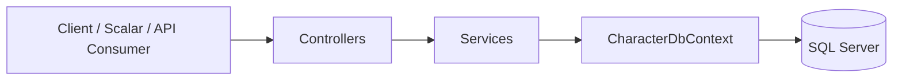

<p align="center">
  
  
  
</p>

<h1 align="center">VideoGameCharacterApi</h1>

<p align="center"><em>Focused backend learning project built to strengthen practical knowledge in ASP.NET Core Web API, Entity Framework Core, SQL Server, JWT authentication, testing, and Dockerized local setup</em></p>

<p align="center">
  
  
  
  
  
  
</p>

</div>

---

## Project Overview

`VideoGameCharacterApi` is a backend-focused ASP.NET Core Web API project created to strengthen practical knowledge in modern server-side development through a structured, implementation-driven approach.

Rather than stopping at basic CRUD, the project is designed to consolidate core backend concepts in a more complete application setting: layered architecture, DTO-based API contracts, Entity Framework Core persistence, SQL Server integration, JWT authentication, role-based authorization, validation, automated testing, and Docker-based local delivery. The goal is to develop a project that is technically coherent, readable, and closer to a realistic engineering workflow than to an isolated tutorial exercise.

### Project Intent

| Goal                       | Description                                                                       |
| -------------------------- | --------------------------------------------------------------------------------- |
| **Backend Practice**       | Apply practical ASP.NET Core Web API design in a project with realistic structure |
| **Engineering Discipline** | Use separation of concerns, explicit DTOs, structured errors, and tests           |
| **Database Integration**   | Model persistence through EF Core and SQL Server                                  |
| **Security Fundamentals**  | Introduce JWT authentication and role-based authorization                         |
| **Delivery Awareness**     | Run the application in a reproducible environment through Docker                  |

---

## Core Capabilities

| Capability                           | Description                                                                    |
| ------------------------------------ | ------------------------------------------------------------------------------ |
| **Character Management**             | Create, retrieve, update, and delete video game character records              |
| **DTO-Based Contracts**              | Request and response models are separated from persistence entities            |
| **Filtering / Sorting / Pagination** | The list endpoint supports more realistic query behavior than a raw table dump |
| **Validation**                       | DTO and query validation reduce invalid input reaching the service layer       |
| **JWT Authentication**               | Login endpoint issues access tokens for protected operations                   |
| **Role-Based Authorization**         | Administrative actions can be restricted by role                               |
| **Structured Error Handling**        | ProblemDetails and a global exception handler improve response consistency     |
| **Automated Tests**                  | Unit and integration tests verify key application behavior                     |
| **Docker Delivery**                  | API and SQL Server can run together in a local containerized setup             |

---

## Technology Stack

| Area                     | Technology                   |
| ------------------------ | ---------------------------- |
| **Language**             | C#                           |
| **Runtime**              | .NET 10                      |
| **Framework**            | ASP.NET Core Web API         |
| **ORM**                  | Entity Framework Core        |
| **Database**             | SQL Server                   |
| **Authentication**       | JWT Bearer                   |
| **API Documentation UI** | Scalar                       |
| **OpenAPI**              | ASP.NET Core OpenAPI support |
| **Testing**              | xUnit                        |
| **Containerization**     | Docker / Docker Compose      |

---

## Architecture Overview



### Architectural Notes

* Controllers remain thin and delegate logic to services.
* Entities are not exposed directly to API consumers.
* Query behavior is intentionally shaped through DTOs and dedicated rules.
* Exception handling is centralized to avoid fragmented error responses.

---

## Repository Structure

```text
VideoGameCharacterApi/
├── Controllers/
├── Data/
├── Dtos/
├── Infrastructure/
├── Migrations/
├── Models/
├── Services/
├── Properties/
├── appsettings.json
├── Dockerfile
├── Program.cs
├── VideoGameCharacterApi.csproj
├── VideoGameCharacterApi.http
└── README.md

VideoGameCharacterApi.Tests/
├── ...
```

---

## Getting Started

### Prerequisites

| Requirement        | Notes                                                   |
| ------------------ | ------------------------------------------------------- |
| **.NET SDK**       | .NET 10 SDK installed                                   |
| **SQL Server**     | Local SQL Server instance available for non-Docker runs |
| **IDE / Editor**   | Visual Studio or Visual Studio Code                     |
| **Optional Tools** | SSMS, Scalar, Postman                                   |

### Local Run

1. Clone the repository.
2. Open the solution in Visual Studio.
3. Confirm the local connection string in `appsettings.json` matches your SQL Server instance.
4. Apply migrations if necessary.
5. Start the API.

### Local Development Notes

| Topic                               | Note                                                                                              |
| ----------------------------------- | ------------------------------------------------------------------------------------------------- |
| **Base URL**                        | The host may run without a root webpage because this is an API project, not a traditional website |
| **Recommended Browser Entry Point** | Use the Scalar route rather than expecting the root URL to behave like a homepage                 |
| **Protected Endpoints**             | Browser address bars do not conveniently attach bearer tokens; use Scalar or another API client   |

---

## Running with Docker

Docker is included to reduce environment setup friction and make the local delivery story more reproducible.

Without Docker, another developer can still run the project manually, but they must reproduce the runtime, database, configuration, and startup sequencing on their own machine.

### Start Command

```bash
docker compose up --build
```

### Docker Routes

| Purpose          | URL                                     |
| ---------------- | --------------------------------------- |
| **API Base URL** | `http://localhost:8080`                 |
| **Scalar UI**    | `http://localhost:8080/scalar`          |
| **OpenAPI JSON** | `http://localhost:8080/openapi/v1.json` |

### Important Route Clarification

| Route                                   | Expected Behavior                              |
| --------------------------------------- | ---------------------------------------------- |
| `http://localhost:8080/`                | May return `404` if no root endpoint is mapped |
| `http://localhost:8080/scalar`          | Main interactive API testing interface         |
| `http://localhost:8080/openapi/v1.json` | Raw OpenAPI specification                      |
| `http://localhost:8080/api/...`         | Actual API endpoints                           |

A `404` at the root URL does not mean the API is broken. It usually means that no homepage route was defined.

---

## Authentication and Authorization

The API uses JWT Bearer authentication.

### Demo Accounts

| Username | Password   | Role    | Intended Use                                |
| -------- | ---------- | ------- | ------------------------------------------- |
| `user`   | `user123`  | `User`  | Basic authenticated access                  |
| `admin`  | `admin123` | `Admin` | Access to protected administrative behavior |

### Authentication Flow

1. Send credentials to `POST /api/Auth/login`.
2. Receive a JWT token.
3. Attach the token as `Authorization: Bearer <token>`.
4. Access protected endpoints according to role requirements.

---

## API Summary

| Method   | Route                           | Description                                        |
| -------- | ------------------------------- | -------------------------------------------------- |
| `POST`   | `/api/Auth/login`               | Authenticates a user and returns a JWT             |
| `GET`    | `/api/VideoGameCharacters`      | Returns paginated and filterable character results |
| `GET`    | `/api/VideoGameCharacters/{id}` | Returns a single character by identifier           |
| `POST`   | `/api/VideoGameCharacters`      | Creates a new character                            |
| `PUT`    | `/api/VideoGameCharacters/{id}` | Updates an existing character                      |
| `DELETE` | `/api/VideoGameCharacters/{id}` | Deletes a character                                |

### Query Surface

| Query Feature        | Purpose                                        |
| -------------------- | ---------------------------------------------- |
| **Pagination**       | Controls page number and page size             |
| **Filtering**        | Narrows results by fields such as game or role |
| **Sorting**          | Orders results by supported sort fields        |
| **Query Validation** | Rejects malformed or unsupported input         |

### Example Request

```http
GET /api/VideoGameCharacters?page=1&pageSize=10&game=Tekken&sortBy=Name&sortDirection=asc
```

---

## Validation and Error Handling

### Validation Strategy

| Area                     | Approach                                              |
| ------------------------ | ----------------------------------------------------- |
| **Request DTOs**         | Data annotation-based validation                      |
| **Query Input**          | Explicit query rules for pagination and list behavior |
| **Model Binding**        | ASP.NET Core request binding and validation pipeline  |
| **Unhandled Exceptions** | Global exception handler                              |

### Error Response Strategy

* Client-side validation issues produce structured client-error responses.
* Unhandled exceptions are centralized instead of being scattered across controllers.
* ProblemDetails support improves consistency and readability.

### ProblemDetails Notes

The project uses a standardized ProblemDetails-oriented error strategy so that consumers receive more coherent error payloads instead of ad hoc strings.

---

## Database and Migrations

The application uses Entity Framework Core with SQL Server.

| Topic                 | Description                                                                 |
| --------------------- | --------------------------------------------------------------------------- |
| **DbContext**         | `CharacterDbContext`                                                        |
| **ORM**               | Entity Framework Core                                                       |
| **Schema Management** | EF Core migrations                                                          |
| **Container Support** | Schema can be applied automatically at startup for containerized local runs |

### Database Notes

* Migrations are tracked in the `Migrations/` folder.
* SQL Server is the persistence target both in manual local runs and in Docker-based runs.
* The Docker workflow is designed to support reproducible local delivery.

---

## Testing

### Current Test Scope

| Test Category                            | Purpose                                               |
| ---------------------------------------- | ----------------------------------------------------- |
| **Query Rule Tests**                     | Verify pagination and query-rule behavior             |
| **Authentication / Authorization Tests** | Validate access control boundaries                    |
| **Success Endpoint Tests**               | Confirm correct behavior on valid paths               |
| **Integration Test Host Setup**          | Shared bootstrapper via `CustomWebApplicationFactory` |

### Run Tests

```bash
dotnet test
```

---

## Delivery Workflow

This repository includes delivery-oriented components that go beyond core CRUD logic.

| Delivery Component      | Purpose                                             |
| ----------------------- | --------------------------------------------------- |
| `Dockerfile`            | Packages the API for containerized execution        |
| `docker-compose.yml`    | Starts the API and SQL Server together              |
| GitHub Actions Pipeline | Intended to automate restore, build, and test steps |


It is designed to show progression from foundational ASP.NET Core practice toward a more disciplined and better-documented API project.
