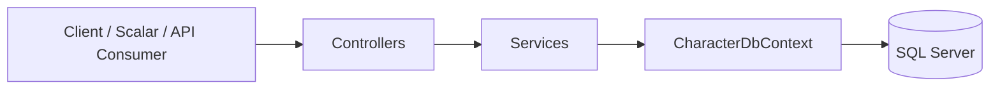
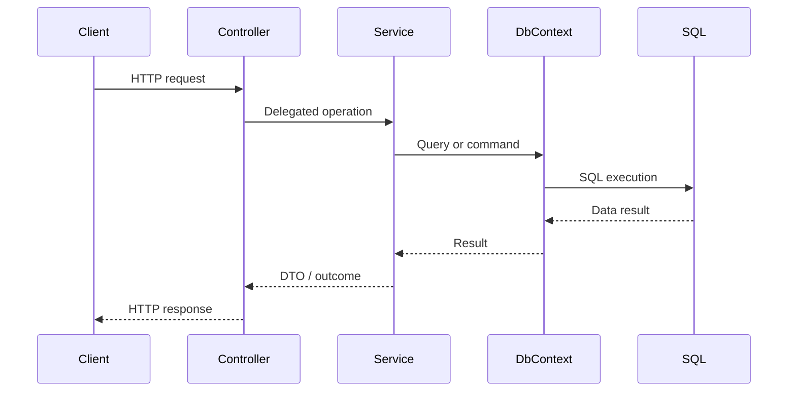

<h1 align="center">Architecture</h1>

<em>Application structure and request flow for VideoGameCharacterApi.</em>

  
  
  

---

## Overview

`VideoGameCharacterApi` uses a layered ASP.NET Core Web API structure that separates HTTP handling, application logic, and persistence. Controllers receive requests, services execute application behavior, and Entity Framework Core reaches SQL Server through `CharacterDbContext`.

## High-Level Flow

## Request Flow

## Layer Responsibilities

| Layer                  | Responsibility                                             |
| ---------------------- | ---------------------------------------------------------- |
| **Controllers**        | Handle routes, model binding, and HTTP responses.          |
| **Services**           | Hold application logic and query behavior.                 |
| **DTOs**               | Define request and response contracts.                     |
| **CharacterDbContext** | Connect EF Core to SQL Server.                             |
| **Infrastructure**     | Support cross-cutting concerns such as exception handling. |

## Controller and Service Boundary

Controllers stay focused on HTTP concerns and delegate application work to services. Services contain the main read and write behavior of the API, including query shaping and entity-to-DTO mapping. This keeps endpoint actions thinner and makes behavior easier to locate and maintain.

## DTO Boundary

The API does not expose database entities directly. Request and response DTOs define the external contract, while entities remain part of the persistence model.

### Request DTOs

* `CreateCharacterRequest`
* `UpdateCharacterRequest`
* `LoginRequest`
* `GetCharactersQuery`

### Response DTOs

* `CharacterResponseDto`
* `PagedResponseDto<T>`
* `LoginResponse`

## Persistence Structure

Persistence is handled through Entity Framework Core and `CharacterDbContext`. The context translates LINQ queries into SQL, coordinates change tracking when needed, and works with migrations to keep the schema aligned with the code model.

## Composition Root

`Program.cs` acts as the composition root of the application. It wires together controllers, the database context, authentication and authorization, OpenAPI and Scalar, exception handling, and the HTTP request pipeline.
