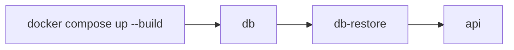

<h1 align="center">Docker and Delivery</h1>

<p align="center"><em>Containerization and local delivery flow for VideoGameCharacterApi.</em></p>

<p align="center">
  
  
  
</p>

---

## Overview

`VideoGameCharacterApi` includes a Docker-based local delivery setup so the API and its database can run in a more reproducible environment. The delivery flow is designed to start SQL Server, restore the required database state, and then start the API container against that database.

## Delivery Components

| Component                | Purpose                                                      |
| ------------------------ | ------------------------------------------------------------ |
| `Dockerfile`             | Builds the API container image.                              |
| `docker-compose.yml`     | Starts the full local container set.                         |
| `database/restore-db.sh` | Runs the database restore step inside the restore container. |
| `.dockerignore`          | Reduces unnecessary files in the build context.              |

## Container Roles

| Service      | Responsibility                                              |
| ------------ | ----------------------------------------------------------- |
| `db`         | Runs SQL Server.                                            |
| `db-restore` | Waits for SQL Server and restores the application database. |
| `api`        | Runs the ASP.NET Core API against the restored database.    |

## Local Docker Start

```bash
docker compose up --build
```

If a clean rebuild is needed:

```bash
docker compose down -v
docker compose up --build
```

## Runtime Flow



The API container is intended to start only after the database container is available and the restore step has completed.

## Main Routes

| Purpose          | URL                                     |
| ---------------- | --------------------------------------- |
| **API Base URL** | `http://localhost:8080`                 |
| **Scalar UI**    | `http://localhost:8080/scalar`          |
| **OpenAPI JSON** | `http://localhost:8080/openapi/v1.json` |

The most useful browser entry point is the Scalar route. The base URL may return a root-route response or documentation entry behavior depending on the current application mapping.

## Database Restore Note

The Docker setup is not limited to starting an empty SQL Server container. It includes a restore step so the application can run against the intended database state rather than against a blank schema only.

This is handled through the dedicated restore container and the restore script under `database/`.
